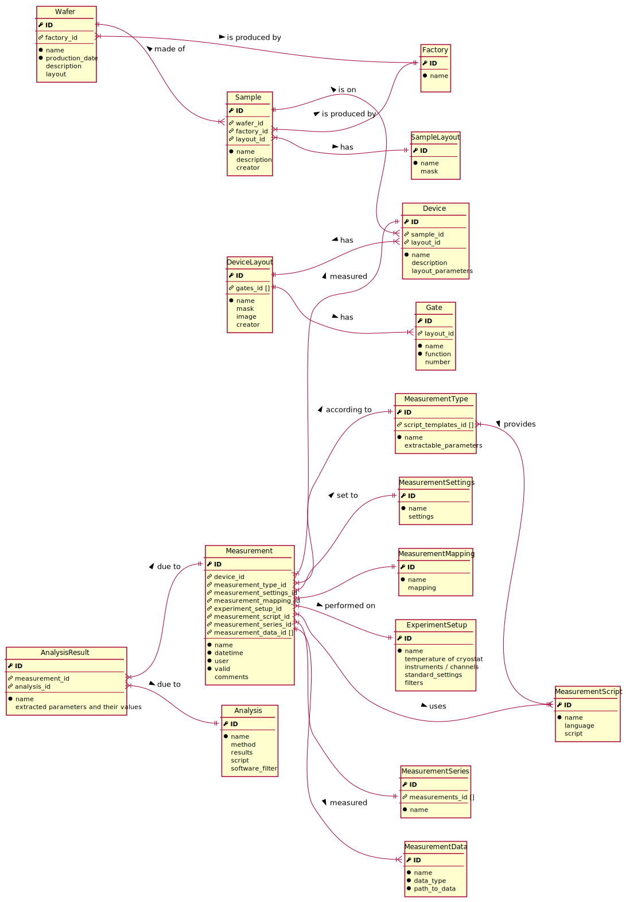
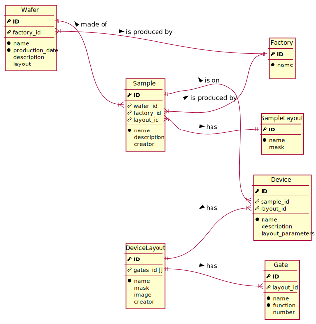

Metadata database
=================

The `qtools-db <https://git-ce.rwth-aachen.de/qutech/lab_software/qtools_db>`__ metadata database has the following structure:

See below for a detailed description of each entity and its data fields.

Fabrication
-----------

Wafer
^^^^^

name (str)
  Wafer name

production_date (date)
  Date of finished production

description (str)
  Description of wafer

heterostructure (link)
  Design of the heterostructure

recipe (link)
  Recipe followed, if all samples fabricated from wafer share the same recipe.
  Includes notes on fabrication done.

layout (str)
  Layout, if all samples fabricated from wafer share the same layout

Factory
^^^^^^^

name (str)
  Factory name

Sample
^^^^^^

name (str)
  Sample name

description (str)
  Description of the sample

fabrication_date (date)
  Date of the finished fabrication

creator (str)
  Name of creator of the recipe

recipe (link)
  Recipe followed, includes notes on fabrication done

fabricator (str)
  Name of person responsible for fabrication

SampleLayout
^^^^^^^^^^^^

name (str)
  Layout name

description (str)
  Description of the layout

Device
^^^^^^

name (str)
  Device name

description (str)
  Description of the device

comment (str)
  Comment on the state of the device

layout_parameters (str)
  Relevant parameters of the device layout

status (str)
  State of the device
  *This should probably be limited to a few choices*

microscope (str)
  Results of microscope investigation
  *This should probably be limited to a few choices*

annealing (str)
  Annealing parameters
  *Is this still necessary?*

responsible_person (str)
  Person responsible for the device at the current time

deliver_date (date)
  Date when the device was delivered to the responsible person

current_location (str)
  Current location of the device

DeviceLayout
^^^^^^^^^^^^

name (str)
  Device layout name

description (str)
  Description of the device layout

image (bytea)
  Image of the DeviceLayout
  *Is this necessary?*

creator (str)
  Name of creator of the layout

layout_file (link)
  Link to layout design file

layout_cell (str)
  Cell referencing the location of the specific device layout
  *Should default to "Top"*

Terminal
^^^^^^^^

name (str)
  Terminal layout name

function (str)
  Function of the terminal in the device

number (int)
  Assigned terminal number

.. Measurement
.. -----------

.. .. image:: diagrams/ERD_measurement/ERD_measurement.svg

.. Measurement
.. ^^^^^^^^^^^

.. MeasurementType
.. ^^^^^^^^^^^^^^^

.. MeasurementSettings
.. ^^^^^^^^^^^^^^^^^^^

.. MeasurementMapping
.. ^^^^^^^^^^^^^^^^^^

.. MeasurementScript
.. ^^^^^^^^^^^^^^^^^

.. MeasurementSeries
.. ^^^^^^^^^^^^^^^^^

.. MeasurementData
.. ^^^^^^^^^^^^^^^

.. ExperimentSetup
.. ^^^^^^^^^^^^^^^

.. Analysis
.. --------

.. Analysis
.. ^^^^^^^^

.. AnalysisResult
.. ^^^^^^^^^^^^^^
