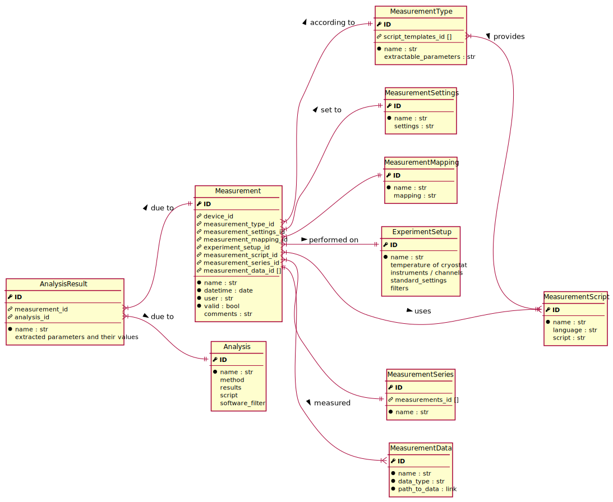

Metadata database
=================

The `qtools-db <https://git-ce.rwth-aachen.de/qutech/lab_software/qtools_db>`__ metadata database has the following structure:

.. image:: diagrams/ERD/ERD.svg

See below for a detailed description of each entity and its data fields.

Fabrication
-----------

.. image:: diagrams/ERD_fab/ERD_fab.svg

Wafer
^^^^^

name
  Wafer name

production_date
  Date of finished production

heterostructure
  Design of the heterostructure

description
  Description of wafer

layout
  Layout, if all samples fabricated from wafer share the same layout

Factory
^^^^^^^

Sample
^^^^^^

name
  Sample name

description
  Description of the sample

creator
  Name of creator of the recipe

recipe
  Recipe followed, includes notes on fabrication done

fabrication_date
  (new) Date of finished fabrication

fabricator
  Name of person responsible for fabrication

SampleLayout
^^^^^^^^^^^^

name
  Layout name

description
  Description of the layout

~mask~

Device
^^^^^^

name
  Device name

description
  Description of the device

comment
  Comment on the state of the device

~link_to_details~

layout_parameters
  Relevant parameters of the device layout

status
  State of the device
  *This should probably be limited to a few choices*

microscope
  Results of microscope investigation
  *This should probably be limited to a few choices*

annealing
  Annealing parameters
  *Is this still necessary?*

~owner~ responsible person
  Person responsible for the device at the current time

~receiver~

deliver_date
  Date when the device was delivered to the responsible person

current_location
  Current location of the device

DeviceLayout
^^^^^^^^^^^^

name
  Device layout name

description
  Description of the device layout

~mask~

image
  ?

creator
  Name of creator of the layout

layout_file
  Link to layout design file

layout_cell
  Cell referencing the location of the specific device layout
  *Should default to "Top"*

Terminal
^^^^^^^^

Measurement
-----------

Measurement
^^^^^^^^^^^

MeasurementType
^^^^^^^^^^^^^^^

MeasurementSettings
^^^^^^^^^^^^^^^^^^^

MeasurementMapping
^^^^^^^^^^^^^^^^^^

MeasurementScript
^^^^^^^^^^^^^^^^^

MeasurementSeries
^^^^^^^^^^^^^^^^^

MeasurementData
^^^^^^^^^^^^^^^

ExperimentSetup
^^^^^^^^^^^^^^^

Analysis
--------

Analysis
^^^^^^^^

AnalysisResult
^^^^^^^^^^^^^^
