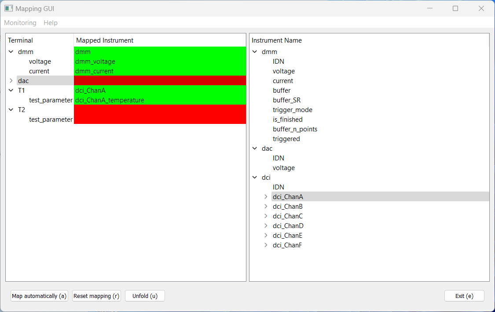

Mapping GUI
===========

This GUI helps you to map the QTools Terminals (shown on left side) to the respective instrument parameters (shown on right side).

You can drag a terminal or one of its parameters (children in tree) to an instrument/channel/parameter. You can also select a terminal/terminal parameter and press the enter key to start a mapping process. The selection switches to the instrument tree where you can select a respective instrument/channel/parameter. Press enter again to map the respective terminal/terminal parameter to the instrument/channel/parameter.

Trying to map a terminal (containing multiple terminal parameters) to an instrument or channel (containing multiple parameters) will result in mapping of all unique pairs (the instrument parameters have an associated terminal parameter in a respective mapping file, which has to be loaded first with the add_mapping_to_instrument function).

If multiple terminal parameters are mapped to the same instrument paramter the involved terminal parameters are marked in pink.

Monitoring is a feature, which repeatedly calls the **get** command (or optionally the cached value) for the mapped parameters.

The **Reset mapping** button resets all mappings. The **Unfold** button folds all terminals in the tree representation (toggling if pressed repeatedly).

The **Map automatically** button maps all uniquely mappable parameters.

