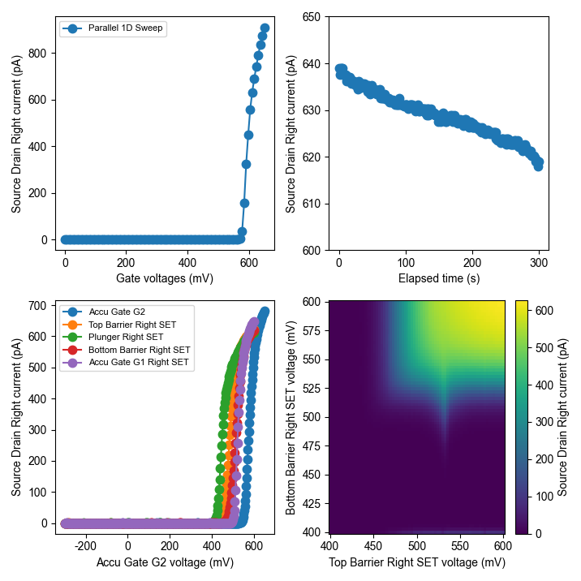

Other
=========

Plotting with QuMada
---------------------------------

QuMada comes with a few useful scripts for quick plotting of results and easier access to QCoDeS datasets.
You can find the corresponding function in src/qumada/utils/plotting.py and load_from_sqlite.py. 

The function "plot_multiple_datasets()" is useful for plotting multiple curves into one plot. Make sure to load the QCoDeS database you want to plot from in advance.
You can either provide a list of datasets you want to plot along with the names of the parameters you want to plot,
or simply leave the datasets argument (and optionally the parameter names empty).
In the latter case, it will guide you through the process of selecting one or more measurements and the parameters you want to plot.

"plot_multiple_datasets" generates automatic legends, labels the axis correctly, can use different markers for different sweep directions, forwards kwargs for matplotlib and more.
Check :ref:`API_DOC` or the docstring for more information. An example is shown below, each of the first three panels was created by using "plot_multiple_datasets".

The last panel was created with "plot_2D()". Here, the methods "get_parameter_data" and "pick_measurement" from load_from_sqlite are helpful to retrieve and unpack nested QCoDeS datasets.
It is possible to create a 2D plot by calling:

.. code:: python

	plot_2D(*get_parameter_data(pick_measurement())

As for plot_multiple_datasets, this will guide you through the selection of a measurement from the current database.
Check :ref:`API_DOC` or the docstring for more information.

